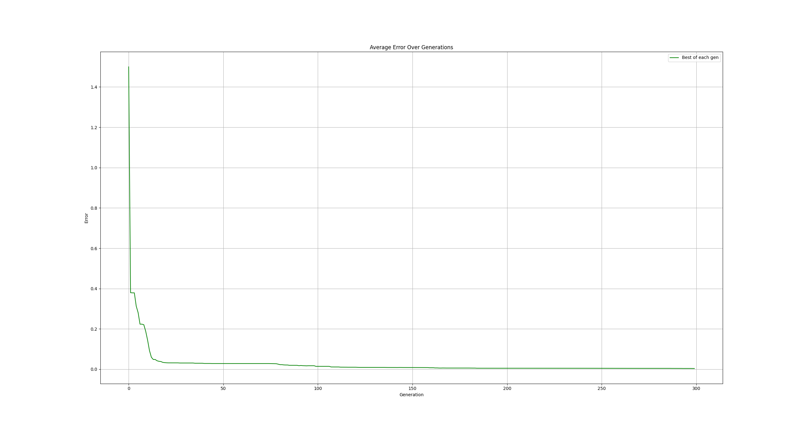
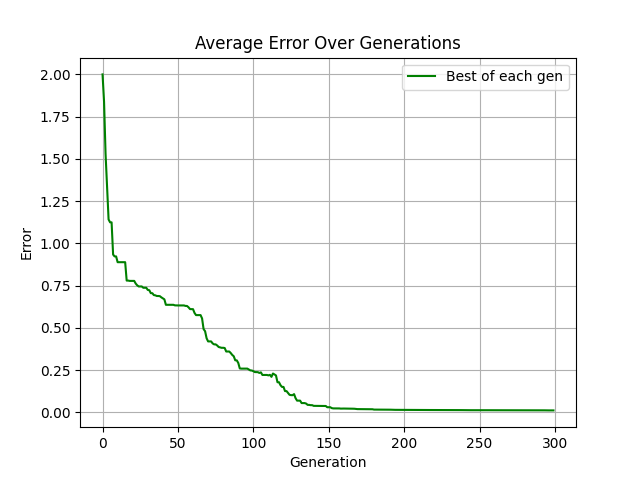
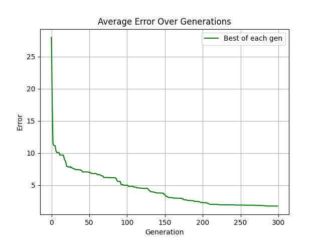

# Dynet
A concept I came up which ditches the idea of "layers" in a neural network.

### XOR Training

### Greater Than or Less Than Test (2 outputs)

### 1k Inputs to single output

## Install
Copy [`Dynet.py`](Dynet.py) to your project.

## Run the example

Install `matplotlib` with `pip install matplotlib` to run the example in 
[`main.py`](main.py).

## How it works
Classic neural networks use layers as a way of organizing neurons. 
"Dynet" uses a single layers to process inputs and outputs where neurons can 
directly connect to outputs or pass through multiple neurons and even connect to themselves

## Usage
To create a `Dynet` object simple use `myNet = Dynet(numInputs, numOutputs, numHiddens)`. Dynet objects have to have at least 1 hidden neuron.
To use the `Dynet` object, use `myNet.feedForward(inputArr)` which will return an array of outputs generated by the neural network.
To mutate the network use `myNet.mutate(mutationRate, amountOfMutations, modifyHiddens)`. `modifyHiddens` is an optional parameter which will mutate hidden nodes if set to True (True by default). `myNet.printNetwork()` will print the current structure of the network and `myNet.copy()` will return a copy of the network 